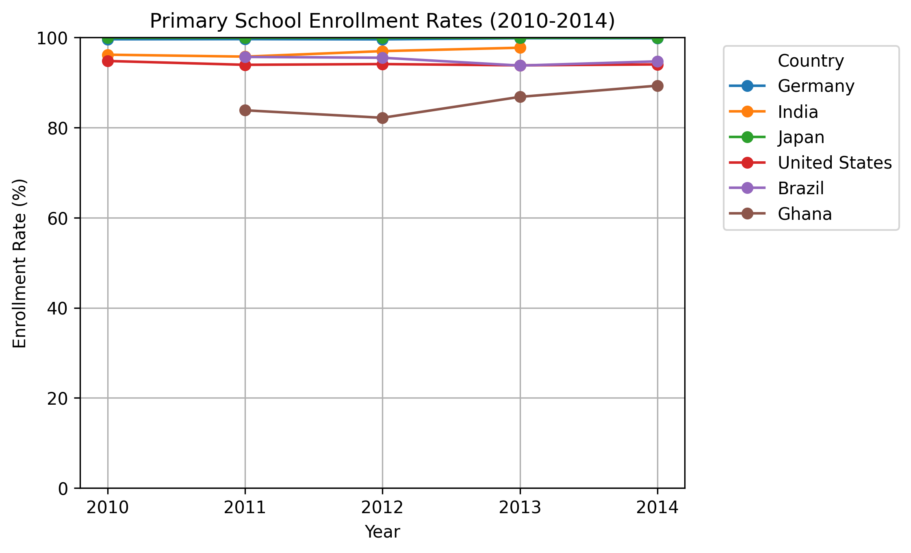
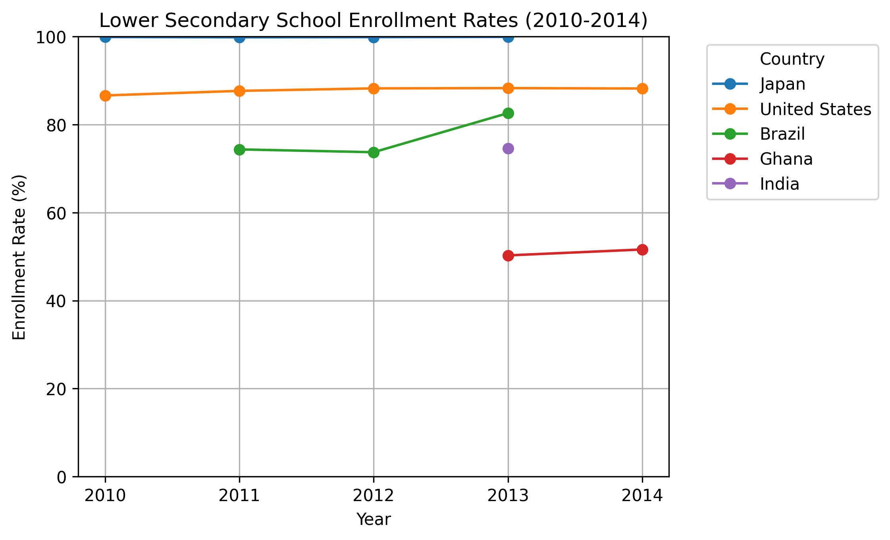
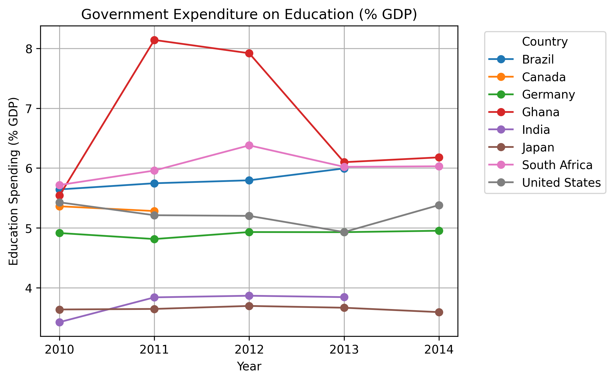
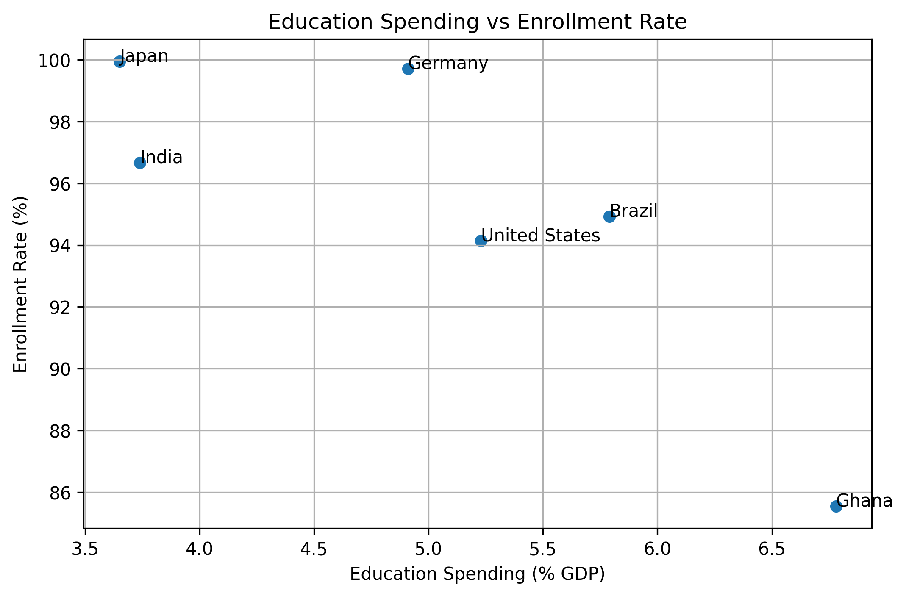

# World Bank Education Statistics Analysis

Portfolio Project | Python | Pandas | Matplotlib | Data Visualization

## Overview

This project analyzes education outcomes and government education spending using the World Bank Education Statistics (EdStats) dataset.

The analysis focuses on selected countries between 2010 and 2014 and explores:

- Primary school enrollment rates
- Lower secondary school enrollment rates
- Government expenditure on education (% of GDP)
- Whether higher education spending is associated with higher enrollment rates

## Project Preview



## Dataset

Source: [World Bank Education Statistics (EdStats)](https://datacatalog.worldbank.org/search/dataset/0038480/education-statistics)

Note: The World Bank EdStats source files are not included in this repository. To reproduce the analysis, download the EdStats dataset from the source above and place the files locally in `datasets/EdStats/`.

## Methods

The notebook loads the World Bank EdStats dataset and filters it to selected countries and education indicators for 2010-2014.

The analysis focuses on:

- Adjusted net primary enrollment rate, both sexes
- Adjusted net lower secondary enrollment rate, both sexes
- Government expenditure on education as a percentage of GDP
- Average primary enrollment compared with average education spending

The workflow includes:

1. Loading and inspecting the EdStats dataset.
2. Filtering countries and indicators relevant to the analysis.
3. Reshaping yearly columns into long format for plotting.
4. Creating line charts for enrollment and spending trends.
5. Computing country-level averages for primary enrollment and education spending.
6. Comparing average education spending with average primary enrollment using a correlation matrix and scatter plot.

## Tools Used

- Python
- Pandas
- Matplotlib
- Jupyter Notebook
- Git
- GitHub

Tested with Python 3.14.x.

## Project Structure

Expected local project structure after downloading the EdStats data:

```text
world_bank_education_analysis/
├── datasets/
│   └── EdStats/
│       ├── EdStatsCountry.csv      # local only; download from World Bank EdStats
│       ├── EdStatsCountry-Series.csv
│       ├── EdStatsFootNote.csv
│       ├── EdStatsSeries.csv
│       └── EdStatsData.csv
├── notebooks/
│   └── world_bank_education_analysis.ipynb
├── exports/
│   ├── charts/
│   │   ├── primary_enrollment.png
│   │   ├── secondary_enrollment.png
│   │   ├── education_spending_gdp.png
│   │   └── spending_vs_enrollment.png
│   └── reports/
│       ├── comparison_results.csv
│       ├── world_bank_education_analysis.html
│       └── world_bank_education_analysis.pdf
├── requirements.txt
└── README.md
```

## Visualizations

### Primary School Enrollment


### Lower Secondary Enrollment



### Government Education Spending



### Spending vs Enrollment



## Key Findings

- Japan and Germany maintained near-universal primary school enrollment rates from 2010 to 2014.
- Ghana had the highest average government education spending among the countries included in the final spending-enrollment comparison, at approximately 6.78% of GDP.
- Ghana also had the lowest average primary enrollment rate in the final comparison group, at approximately 85.55%.
- Lower secondary enrollment showed wider variation than primary enrollment, especially for Ghana and Brazil.
- In the six-country sample used for the final comparison, average education spending as a percentage of GDP and average primary enrollment had a strong negative correlation. Because the sample is small and the analysis is descriptive, this result should be treated as exploratory and should not be overinterpreted as evidence that higher spending reduces enrollment.
- Higher education spending alone did not explain enrollment outcomes; country context, policy effectiveness, demographics, and baseline development levels likely matter.

## Limitations

- The analysis covers a short time window, 2010-2014, which limits conclusions about long-term education trends.
- Several selected countries and indicators had missing data, reducing the final comparison set.
- The spending-enrollment comparison uses country-level averages, which can hide year-to-year variation.
- The analysis is descriptive and does not control for income level, population structure, education policy, conflict, urbanization, or other factors that may affect enrollment.
- Correlation between spending and enrollment does not imply causation.
- Government spending as a percentage of GDP does not capture total education investment, spending efficiency, allocation by education level, or absolute spending per student.

## Reproducibility

The notebook can reproduce the analysis workflow and regenerate the chart outputs in `exports/charts/`.

To reproduce the notebook analysis and charts:

1. Clone this repository.
2. Download the World Bank EdStats dataset from the source linked above.
3. Place the EdStats CSV files locally in:

```text
datasets/EdStats/
```

4. Install the Python dependencies:

```bash
pip install -r requirements.txt
```

5. Open and run the notebook:

```bash
cd notebooks
jupyter notebook world_bank_education_analysis.ipynb
```

The notebook uses project-root path detection, so it can be run from either the project root or the `notebooks/` folder. The dataset is read from `datasets/EdStats/`, and chart PNGs are saved to `exports/charts/`.

The files in `exports/reports/`, including `comparison_results.csv`, `world_bank_education_analysis.html`, and `world_bank_education_analysis.pdf`, are included as project deliverables, but they are not currently regenerated by code in this repository.

## Project Deliverables

- [Jupyter Notebook](notebooks/world_bank_education_analysis.ipynb)
- [PDF Report](exports/reports/world_bank_education_analysis.pdf)
- [HTML Report](exports/reports/world_bank_education_analysis.html)
- [Results CSV](exports/reports/comparison_results.csv)

## Author

GitHub: [loremipsumxo](https://github.com/loremipsumxo)
